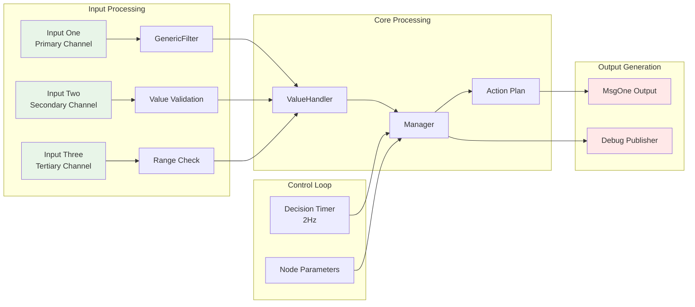
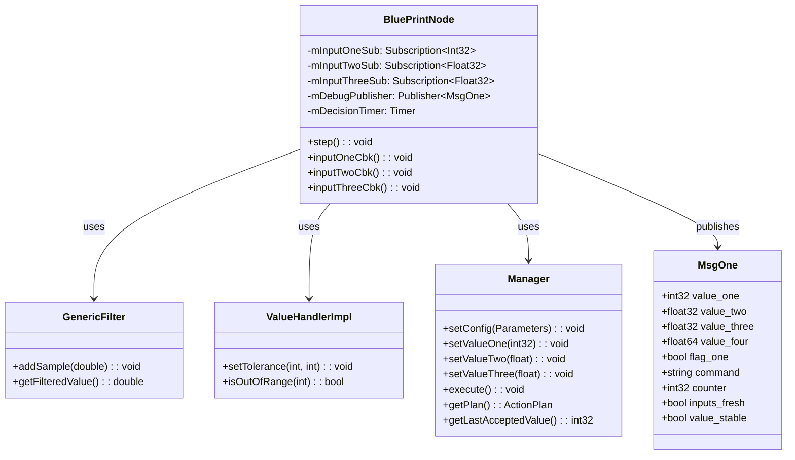

# ROS 2 Node Blueprint

A comprehensive, production-ready ROS 2 node blueprint featuring modular architecture, robust testing, and clean separation of concerns. This template provides a solid foundation for building complex ROS 2 applications with proper software engineering practices.

## 📦 Package Structure

```
ros_node_blueprint/
├── 📁 src/                          # Main source directory
│   ├── BluePrintNode.{cpp,hpp}      # Primary ROS 2 node implementation
│   ├── BluePrintMain.cpp            # Node executable entry point
│   ├── NodeHelperFunctions.{cpp,hpp}# Utility functions
│   ├── TopicMessage.hpp             # Message caching utilities
│   ├── NodeConstants.h              # System constants
│   ├── 📁 core/                     # Core business logic modules
│   │   ├── ModuleOne/               # Generic filtering capabilities
│   │   ├── ModuleTwo/               # Value handling and validation
│   │   └── ModuleThree/             # Decision management
│   └── 📁 tests/                    # Node-level integration tests
├── 📁 msg/                          # Custom message definitions
│   └── MsgOne.msg                   # Primary data structure
├── 📁 launch/                       # Launch configurations
│   └── blueprint.launch.py          # Main launch file
├── 📁 config_templates/             # Configuration templates
└── 📁 target_templates/             # Deployment templates
```

## 🏗️ Architecture Overview

### Data Flow Architecture



### Component Architecture



## 🚀 Key Features

### **Modular Design**
- **Separation of Concerns**: Each module handles a specific domain (filtering, validation, management)
- **Loose Coupling**: Modules communicate through well-defined interfaces
- **Independent Testing**: Each module can be tested in isolation

### **ROS 2 Best Practices**
- **Parameter Management**: Dynamic reconfiguration support
- **Quality of Service**: Configurable QoS profiles for reliable communication
- **Lifecycle Management**: Proper node initialization and cleanup
- **Launch System**: Parameterized launch files for flexible deployment

### **Robust Testing Framework**
- **Multi-Level Testing**: Unit tests for modules, integration tests for the node
- **CMake Integration**: Built-in test discovery and execution
- **Continuous Integration Ready**: Automated testing pipeline support

### **Production Ready**
- **Error Handling**: Comprehensive error handling and logging
- **Configuration Management**: JSON5 configuration files with validation
- **Performance Monitoring**: Built-in timing and performance metrics
- **Documentation**: Comprehensive code documentation and examples

## 🛠️ Quick Start

### Prerequisites
- ROS 2 Humble (or Jazzy)
- CMake 3.5+
- C++17 compatible compiler

### Build and Run

```bash
# Build and launch the node
./run_node.sh

# Run all tests
./run_node_tests.sh

# Run module-specific tests
./run_tests_dir.sh src/core/ModuleOne/tests
```

### Launch with Parameters

```bash
ros2 launch ros_node_blueprint blueprint.launch.py run_dir:=/path/to/config
```

## 🔧 Configuration

The node uses JSON5 configuration files for flexible parameter management:

```json5
{
  "decision_rate_hz": 2.0,
  "enable_decision_timer": true,
  "modules": {
    "filter": {
      "window_size": 10,
      "threshold": 0.5
    },
    "validator": {
      "min_value": -100,
      "max_value": 100
    }
  }
}
```

## 🧪 Testing Strategy

### Unit Tests
- **Module One**: Filter algorithm validation
- **Module Two**: Value range and validation logic
- **Module Three**: Decision management and action planning

### Integration Tests
- **Node Behavior**: End-to-end message processing
- **Parameter Handling**: Configuration validation
- **Error Scenarios**: Fault tolerance and recovery

## 📈 Extensibility

This blueprint is designed for easy extension:

1. **Add New Modules**: Follow the existing module pattern in `src/core/`
2. **Extend Messages**: Modify `MsgOne.msg` or add new message types
3. **Add Services/Actions**: Framework ready for ROS 2 services and actions
4. **Custom Parameters**: Extend the configuration system

## 📋 Development Scripts

| Script | Purpose |
|--------|---------|
| `run_node.sh` | Build and launch the complete system |
| `run_node_tests.sh` | Execute full test suite via colcon |
| `run_tests_dir.sh <dir>` | Run specific module tests |

## 📝 Notes

- **Blueprint Nature**: Core logic uses stubs/pseudocode - ready for your implementation
- **Portfolio Ready**: Clean architecture suitable for demonstrations
- **Production Path**: Clear upgrade path from prototype to production system
